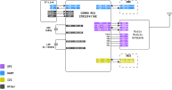
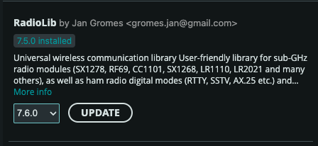

# Communication (COM) Subsystem

The **Communication (COM) Subsystem** acts as the satellite's primary wireless link to the Earth. Its fundamental role is to receive telecommands from the Ground Station and transmit vital telemetry data back to users, ensuring the satellite remains under control throughout its mission. 

This subsystem is powered by the **STM32F411RE** microcontroller, which manages a high-performance **RFM98PW** radio module for long-range data transmission.

## Key Capabilities and Features

The COM subsystem is engineered to meet specific aerospace communication standards, offering several core features:

### 1. High-Performance Radio Link
*   **Frequency:** Operates at **433 MHz**, providing a robust link for amateur satellite bands.
*   **Transmit Power:** Capable of a high output power of **27 dBm**, ensuring signals can reach the ground station effectively.
*   **Flexible Data Rates:** Supports data rates from **4.8 kbps up to 9.6 kbps**, allowing for a balance between range and throughput.
*   **Antenna Options:** Features an integrated antenna for standard use and a dedicated connector for attaching external high-gain antennas.

### 2. Multi-Protocol Support
*   **KISS Protocol:** Supports the "Keep It Simple, Stupid" (KISS) protocol, a standard for framing data packets over serial and radio links.
*   **Internal Communication:** Uses high-speed **SPI** to communicate between the STM32 MCU and the radio module, and **UART** to interface with the On-Board Computer (OBC).
*   **Direct Sensor Access:** Connected to the shared **I2C bus**, allowing the COM module to read EPS telemetry (like battery voltage) directly for independent health reporting.

### 3. Interface with the OBC
The COM subsystem and the OBC work in tandem to process incoming commands:

*   **Command Handling:** When the COM module receives a packet from the ground, it passes the data to the OBC via a dedicated UART link (PA2/PA3).
*   **Telemetry Reporting:** The OBC sends system status updates to the COM module, which then modulates and transmits them back to the Ground Station.

---

## Block Diagram

<figure>

<caption>Communication Block diagram</caption>
</figure>

## Example Code & Documentation

The following examples provide a starting point for developing your own communication software. They demonstrate how to handle messages between the OBC and how to configure the radio for transmission and reception.

### Prerequisite Library
These Arduino Library are needed to be installed to be able to use provided example code

1. **RadioLib** is a versatile radio communication library that supports a wide range of wireless modules, including LoRa, FSK, and other RF transceivers. It handles packet encoding, modulation settings, and radio control, making it easy to implement long-range or low-power wireless communication. This project uses RadioLib to manage communication with the LoRa module.
<figure>

</figure>
> Code provided works with library version 7.5.0
>
> Library can be installed from Arduino IDE's library manager

| Feature | Description | Code Link |
| :--- | :--- | :--- |
| **Radio TX/RX** | Basic routine to initialize the RFM98PW and send/receive radio packets. | [commu_tx_rx.ino](../codes/communication/commu_tx_rx/commu_tx_rx.ino) |
| **OBC Link** | Demonstrates how the COM module receives and responds to messages from the OBC. | [commu_msg_from_obc.ino](../codes/communication/commu_msg_from_obc/commu_msg_from_obc.ino) |

**Note:** For the communication link to work, ensure your Ground Station is configured to the same frequency (433 MHz) and data rate as your satellite's COM module.