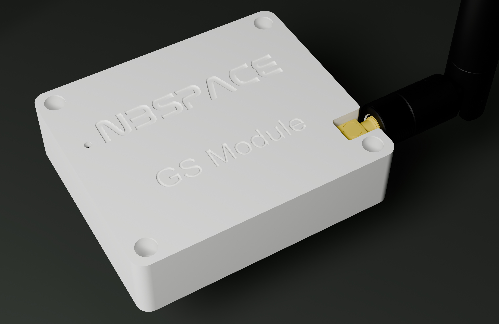
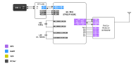
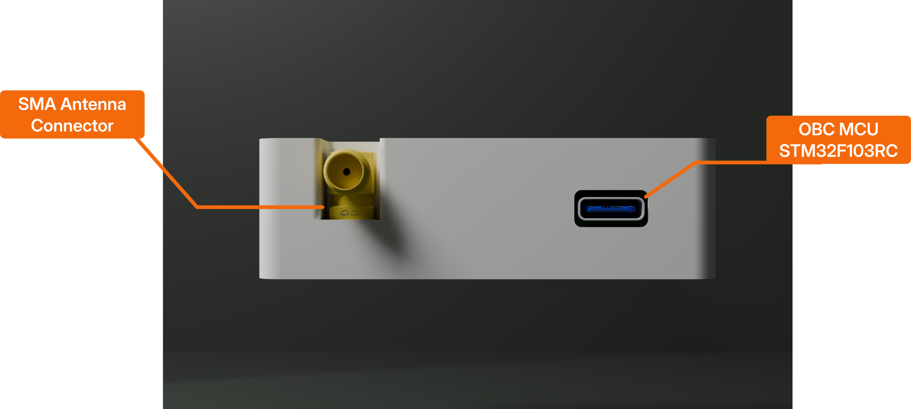

# Ground Station (GS) Subsystem

The **Ground Station (GS)** is the terrestrial component of the FlatSat Learning Kit, acting as the bridge between the satellite and the operator. Its primary role is to mimic a real-world satellite ground station by receiving telemetry from the FlatSat and transmitting telecommands to control its mission.

<figure>

<caption>Ground Station</caption>
</figure>

## System Overview

The Ground Station is built on a high-performance architecture designed for reliable long-range communication and seamless computer integration.

### 1. Processing and Control
*   **Microcontroller:** It is powered by the **STM32F103RC** MCU, which handles the complex tasks of modulating/demodulating radio signals and managing the serial interface with the user's computer.
*   **Computer Interface:** A **USB-C** connection provides both power to the module and a high-speed data link (via ST-Link) for the operator to send commands and view real-time satellite data.

### 2. Wireless Communication
*   **Radio Module:** Equipped with an **RFM98PW** radio module, the Ground Station communicates on the **433 MHz** frequency band.
*   **Performance:** It is capable of a high transmit power of **27 dBm**, ensuring a strong link even in challenging environments.
*   **Data Handling:** The system supports a data rate of **9.6 kbps**, optimized for reliable transmission of satellite telemetry packets.

### 3. Hardware Connectivity
*   **SPI Interface:** The MCU communicates with the radio module using a dedicated high-speed **SPI** bus (MOSI: PA7, MISO: PA6, SCK: PA5, NSS: PB6).
*   **Digital I/O:** Multiple digital pins (PA8–PA10, PC1, PC7, PC8) are utilized for radio interrupts and reset signals to ensure robust operation.
*   **Clock Accuracy:** The board includes a 16MHz High-Speed External (HSE) crystal and a 32.768kHz Low-Speed External (LSE) crystal for precise timing during data processing.

<figure>

<caption>Ground Station Block diagram</caption>
</figure>

<figure>

<caption>Ground Station Block diagram</caption>
</figure>

---

## Technical Specifications

| Feature | Specification |
| :--- | :--- |
| **Processor** | STM32F103RC (ARM Cortex-M3) |
| **Radio Frequency** | 433 MHz |
| **Transmit Power** | 27 dBm |
| **Data Rate** | 9.6 kbps |
| **PC Connection** | USB-C (UART via ST-Link) |
| **Antenna** | SMA Antenna connector support |

---

## Example Code

The following code provides a complete setup for the Ground Station, enabling it to transmit and receive radio packets. This script is essential for establishing the first "handshake" between your ground station and the FlatSat.

| Feature | Description | Code Link |
| :--- | :--- | :--- |
| **GS TX/RX** | Initialize the Ground Station radio and perform basic transmit/receive operations. | [gs_tx_rx.ino](../codes/gs/gs_tx_rx/gs_tx_rx.ino) |

**User Note:** When deploying your Ground Station, ensure the radio settings (Frequency, SyncWord, and Bitrate) exactly match those configured on the satellite's Communication module to establish a successful link.