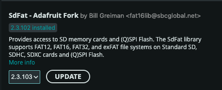
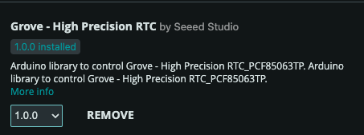

# On-Board Computer (OBC) Subsystem

The **On-Board Computer (OBC)** serves as the primary "brain" of the FlatSat satellite, responsible for coordinating mission logic, handling data, and managing communication between all other subsystems,,. It is built around the high-performance **STM32F429ZI** microcontroller, which provides the necessary processing power and peripheral connectivity for satellite operations.

<figure>
<!-- Full-Board Highlight -->
<svg viewBox="0 0 6300 5400" width="100%" style="border-radius: 8px; margin-bottom: 1rem;" xmlns="http://www.w3.org/2000/svg">
  <defs>
    <mask id="obc-mask">
      <rect width="6300" height="5400" fill="white" opacity="0.3" />
      <rect x="4190" y="314" width="1920" height="2152" fill="white" rx="50" />
    </mask>
  </defs>
  <image href="../../assets/flatsat_board.jpg" width="6300" height="5400" mask="url(#obc-mask)" />
  <rect x="4190" y="314" width="1920" height="2152" fill="none" stroke="#00e5ff" stroke-width="30" rx="50" />
  <text x="4190" y="280" fill="#00e5ff" font-size="200" font-family="sans-serif" font-weight="bold" style="text-shadow: 2px 2px 10px #000, -2px -2px 10px #000, 0 0 20px #000;">OBC Location</text>
</svg>

<!-- Cropped Section with Labels -->
<svg viewBox="3446 334 3270 2102" width="100%" style="border-radius: 8px; box-shadow: 0 4px 6px rgba(0,0,0,0.1);" xmlns="http://www.w3.org/2000/svg">
  <image href="../../assets/flatsat_board.jpg" width="6300" height="5400" />
  <!-- Highlights inside the crop -->
  <rect x="5250" y="830" width="400" height="400" fill="none" stroke="#ff007f" stroke-width="15" rx="30" />
  <text x="5250" y="800" fill="#ff007f" font-size="120" font-family="sans-serif" font-weight="bold" style="text-shadow: 2px 2px 10px #000, -2px -2px 10px #000, 0 0 20px #000;">MCU (STM32F429ZI)</text>
  
  <rect x="5020" y="1140" width="80" height="80" fill="none" stroke="#ff007f" stroke-width="15" rx="30" />
  <text x="4000" y="1100" fill="#ff007f" font-size="80" font-family="sans-serif" font-weight="bold" style="text-shadow: 2px 2px 10px #000, -2px -2px 10px #000, 0 0 20px #000;">Temperature Sensor TMP102</text>
</svg>
<caption>OBC Pinout diagram</caption>
</figure>

<figure>

<caption>OBC Block Diagram</caption>
</figure>

## Key Capabilities and Features

Based on the system architecture and technical requirements, the OBC manages the following core functions:

### 1. Central Processing & Logic

*   **Microcontroller:** Utilizes an STM32F429ZI MCU for high-level processing.
*   **Mission Execution:** Coordinates tasks such as taking images, reading GPS coordinates, and communicating with the ground station,,.
*   **System Testing:** Executes unified test routines to verify the health of GPIO, UART, I2C, SPI, and connected sensors,.

### 2. Data Storage & Memory
The OBC provides multiple layers of memory for flight software, telemetry logging, and mission data:

*   **Internal Flash:** 2 MB of high-speed internal storage.
*   **External SPI Flash:** A 128M-bit (16 MB) W25Q128 memory chip for non-volatile data storage,.
*   **Micro SD Card:** Supports high-capacity storage via a dedicated SPI interface, essential for saving large mission files like payload images,,.

### 3. Peripheral Connectivity
The OBC interacts with the rest of the satellite through various standardized protocols,:

*   **Dual I2C Buses:** 
    *   **Internal I2C:** Connects to an on-board Real-Time Clock (RTC) and temperature sensors,.
    *   **EPS I2C:** Directly controls the Electrical Power System's sensors (INA226, TMP102) and hot-swap controllers (ADM1177),,.
*   **Multi-Channel UART:** 
    *   **GPS:** Dedicated link for satellite positioning data,,.
    *   **Communication Subsystem:** Facilitates telecommand and telemetry links to the Ground Segment,,,.
    *   **Debug/Console:** Connected to the ST-Link for real-time monitoring via a PC.
*   **SPI Bus:** High-speed connection used for the Camera Payload and SD card operations,,.
*   **CAN Bus:** Integrated via an SN65HVD230 transceiver, providing a robust interface to the PC104 expansion bus for additional user subsystems,,.

### 4. Integrated Power Management
The OBC directly manages the satellite's power distribution,:

*   **Direct Control:** Four dedicated GPIO pins (PD0–PD3) act as power control switches,,.
*   **Monitoring:** Through the EPS I2C bus, the OBC can read real-time voltage, current, and battery health data directly from the hardware sensors,,.

---

## Example Code & Documentation

### Prerequisite Library
These Arduino Library are needed to be installed to be able to use provided example code

**SdFat** is an advanced SD card file system library that provides fast and reliable read/write access to SD cards using SPI. It is more efficient and stable than the default SD library, especially when working with large files or continuous data logging. This project uses SdFat to store sensor data and system logs on the SD card.
<figure>

</figure>
**Grove High Precision RTC** (PCF85063TP) is a real-time clock library used to keep accurate time even when the microcontroller is powered off. It provides timestamping for files, logs, and events, ensuring the system always maintains correct date and time information. This project uses the RTC to timestamp sensor readings and system activity.
<figure>

</figure>

> All libraries can be installed form Arduino IDE-s Library manager

The following example codes demonstrate how to interact with the OBC's hardware features. These files can be integrated into your development environment to learn the fundamentals of satellite embedded programming.

| Feature | Description | Code Link |
| :--- | :--- | :--- |
| **System Test** | A unified routine testing all OBC peripherals sequentially. | [obc_system_test.ino](../codes/obc/obc_system_test/obc_system_test.ino) |
| **EPS Monitoring** | Read voltage and current from the EPS sensors via I2C. | [obc_read_eps.ino](../codes/obc/obc_read_eps/obc_read_eps.ino) |
| **Power Control** | Toggle the four primary power channels (PD0–PD3). | [obc_power_control.ino](../codes/obc/obc_power_control/obc_power_control.ino) |
| **Camera to SD** | Capture an image from the payload and save it to the SD card. | [obc_camera2sd.ino](../codes/obc/obc_camera2sd/obc_camera2sd.ino) |
| **GPS Acquisition** | Read and parse positioning data from the GPS module. | [obc_gps_read.ino](../codes/obc/obc_gps_read/obc_gps_read.ino) |
| **Commu Link** | Send messages and telecommands to the Communication module. | [obc_msg_to_commu.ino](../codes/obc/obc_msg_to_commu/obc_msg_to_commu.ino) |
| **SPI Flash** | Interface with the external W25Q128 memory chip. | [obc_flash.ino](../codes/obc/obc_flash/obc_flash.ino) |
| **SD Card** | Initialize and perform basic file operations on the Micro SD card. | [obc_sd_card.ino](../codes/obc/obc_sd_card/obc_sd_card.ino) |
| **I2C Scanning** | Identify connected devices on the Internal and EPS I2C buses. | [obc_int_i2c_scan.ino](../codes/obc/obc_int_i2c_scan/obc_int_i2c_scan.ino) |